<!-- ════════════════════════════════════════════════════════════════════ -->
<!--                    FAYSAL ALI SHAH · PROFILE README                   -->
<!-- ════════════════════════════════════════════════════════════════════ -->

<div align="center">

<!-- 🎬 Custom animated banner (hand-built SVG, loops live on GitHub) -->


<br/><br/>

<!-- Animated typing line -->
<a href="https://zero-state-logic.github.io/portfolio/">
  
</a>

<br/>

<!-- Social badges -->
<p>
  <a href="https://zero-state-logic.github.io/portfolio/">
    
  </a>
  <a href="https://www.linkedin.com/in/faysal-ali-shah-101ak101/">
    
  </a>
  <a href="mailto:engr.faysalshah@gmail.com">
    
  </a>
  
</p>


</div>

<br/>

<!-- ===================== ABOUT ===================== -->
### 🛰&nbsp;&nbsp;About

```yaml
name:        Faysal Ali Shah
role:        Electrical Engineering Student @ NUST
focus:       [Robotics, Embedded Systems, Machine Learning, Automation]
semester:    6 / 8
graduation:  2027
status:      Open to internships & research collaborations
mindset:     Build research-worthy systems, not just demos.
```

<br/>

<!-- ===================== PROJECTS ===================== -->
### 🤖&nbsp;&nbsp;Featured Projects

> **Six systems. One philosophy.**  
> Every project below is fully built and tested — spanning autonomous robotics, embedded firmware, automation, and commercial hardware. A few are private (active competition entries or commercial IP) and are noted as such.

<table>
<tr>
<td width="50%" valign="top">

#### 🧹 NeuroSweep
`ROS 2` · `Webots` · `SLAM` · `Bayesian Inference`

Autonomous cleaning-robot simulation with SLAM navigation and a custom **Bayesian Inference Node** that builds real-time probabilistic dirt heatmaps to plan the most efficient route.

</td>
<td width="50%" valign="top">

#### 🔗 LinkedIn Automation Bot
`Python` · `Selenium` · `Stealth`

Production-grade data-collection tool with stealth browsing, CSV logging, pagination, session resume, and duplicate detection — engineered for reliability at scale.

</td>
</tr>
<tr>
<td width="50%" valign="top">

#### 🖱 Air Mouse &nbsp;<kbd>◆ Commercial</kbd>
`IMU` · `BLE` · `PCB Design` · `Embedded C`

Wireless handheld **IMU-driven cursor controller**, built end-to-end as a commercial product — hardware, firmware, and custom PCB designed in-house. _Closed source — contact for a demo._

</td>
<td width="50%" valign="top">

#### 📡 Bidirectional Morse Code Transceiver
`ESP32` · `ESP-NOW` · `Embedded C` · `I2C`

Peer-to-peer wireless link between two ESP32 nodes over **ESP-NOW (<100 ms latency)**, with live Morse encode/decode, an I²C LCD, and haptic feedback.

</td>
</tr>
<tr>
<td width="50%" valign="top">

#### 🏎 Advanced PID Line Follower &nbsp;<kbd>◈ Competition</kbd>
`Arduino Nano` · `L298N` · `PID` · `IR Array`

5-way IR sensor array with a finely tuned **PID controller** (Kp 0.25 · Ki 0.0001 · Kd 0.5), junction detection, and multi-step path navigation. _Private — active competition entry._

</td>
<td width="50%" valign="top">

#### 🕌 QurbaniDesk
`Python` · `PDF Generation` · `Offline-First`

Offline-first management tool for mosques running **Qurbani** (Islamic ritual sacrifice): donor registration, livestock inventory, share allocation & pricing, and auto-generated PDF receipts — no internet required.

</td>
</tr>
</table>

<div align="center">
<sub>🔎 More projects — including <b>VitalScope</b> (handheld health monitor) and <b>Dasai Mochi</b> (ESP32 AI desk buddy) — on my <a href="https://zero-state-logic.github.io/portfolio/">portfolio</a>.</sub>
</div>

<br/>

<!-- ===================== TECH STACK ===================== -->
### 🛠&nbsp;&nbsp;Tech Stack

<p>
  
  
  
  
</p>
<p>
  
  
  
  
</p>
<p>
  
  
  
  
</p>
<p>
  
  
  
  
</p>

<br/>

<!-- ===================== STATS ===================== -->
### 📊&nbsp;&nbsp;GitHub Stats

<div align="center">


<br/>

</div>

<br/>

<!-- ===================== EDUCATION ===================== -->
### 🎓&nbsp;&nbsp;Education & Credentials

**B.Sc. Electrical Engineering** — NUST &nbsp;·&nbsp; 2023–2027 &nbsp;·&nbsp; 6th Semester  
**Data Analytics Intern** — KPMG Australia (via Fluxxion) &nbsp;·&nbsp; Jun–Jul 2025  
**Certifications** — Machine Learning Using Python · Databricks for ML · ML Bootcamp (GDG PIEAS) · Python 2000 · C++ Essentials 1 (NUST/Cisco) · Digital Skills: AI (Accenture · 86%)

<br/>

<!-- ===================== CONTACT ===================== -->
<div align="center">

### 💬&nbsp;&nbsp;Let's build something.

<a href="mailto:engr.faysalshah@gmail.com">
  
</a>
&nbsp;
<a href="https://www.linkedin.com/in/faysal-ali-shah-101ak101/">
  
</a>
&nbsp;
<a href="https://wa.me/923295709505">
  
</a>

<br/><br/>
<sub>⚡ <em>Available for internships, research collaborations, and engineering roles · 2026</em></sub>

</div>
